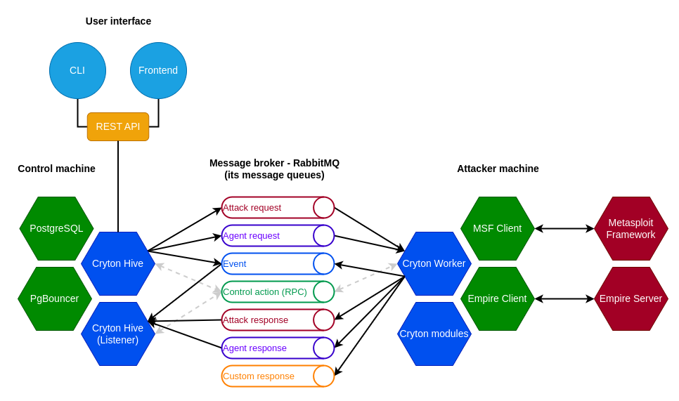

## Hive
Hive is the brain of Cryton. It provides you with options to manage Workers, scenarios, and executions.  
Its purpose is to store scenarios, states, evidence, and control the executions based on given parameters.

It can be managed through its [REST API](interfaces/rest-api.md).

## CLI
There are two ways to interact with Cryton or, more precisely, utilize its REST API.

One of them is CLI, which allows a simple way to run (possibly automate) actions from the terminal.

## Frontend
A user-friendly alternative to CLI is [Cryton Frontend](interfaces/frontend.md), a graphical web interface providing additional functionality to improve the user experience.

## Worker
An orchestrator for executing modules remotely. It gives you the option to validate module input, manage module execution, and gather results. It communicates with Hive using RabbitMQ message broker.

## Modules
Cryton (attack) modules are a collection of Python scripts with the goal of orchestrating known offensive security tools (Nmap, Metasploit, Medusa, ...).

---

## Technological decisions
The next section tries to explain the choices for the currently employed technologies.

### APScheduler
This was the first choice made for the scheduler module. It allows you to schedule a Python method on a specific time or day or even interval. 
It is pretty lightweight and does not need much in terms of resources or capacity. So far we have not found anything better suited for the task.

### Django ORM
In the beginning, Cryton used the SQLite database with direct access. That changed as SQLite is not good with scaling for the future. The second choice was PostgreSQL, which stayed to this day, but it was updated with the use of the Django ORM. Using the Django REST framework for the REST interface also emerged from this choice.

### Rabbit MQ
For developing Master-Worker architecture, where you can issue commands remotely, we needed some kind of RPC. Although, as experience showed us, we also needed it to be asynchronous. That's why we chose a messaging broker RabbitMQ.

### Metasploit
I guess everyone in the IT security field has heard about the Metasploit framework. It is one of the most complete and usable open-source attack tools available. Of course, Cryton uses it for some attack modules - the majority of simulated attacks in CDXs usually do use Metasploit in some way. But its attacking capabilities are not the only reason to use it. Its real advantage is Metasploit's session management. Every time you open a session to some machine it stores it under a specific ID which you can later use to communicate with the target. This is one of the main features you can use while executing your attack scenario in Cryton.

### Empire
For post-exploitation attacks, we decided to add support for an open-source project called Empire. Empire is 
a post-exploitation framework that includes pure-PowerShell Windows agents, Python 3 Linux/OS X agents, and C# agents. 
The framework offers cryptological-secure communications and flexible architecture. This is done via asynchronous 
communication between our Worker component and an Empire c2 server.

### Docker (compose)
To bundle everything together and make the deployment effortless, we use Docker or Docker Compose configurations.
