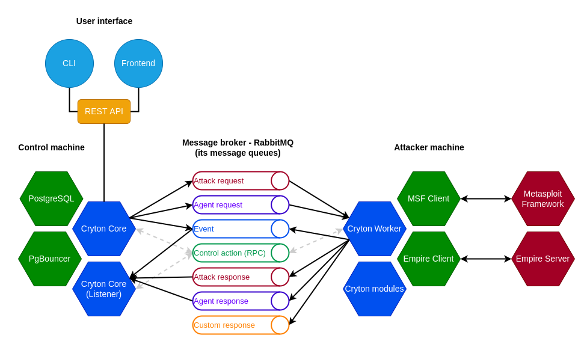

## Core
The main functionality is implemented in [Cryton Core](components/core.md). As the name suggests, this is the core component of the Cryton toolset. 
It gives you the ability to create and control attack plans, generate reports, and control Workers.

!!! note ""

    To issue commands use the provided [REST API](interfaces/core-rest-api.md).

## CLI and Frontend
There are two ways to interact with Cryton or, more precisely, utilize its REST API.

One of them is [Cryton CLI](components/cli.md), which allows a simple way to run (automate) actions from the terminal.

A slightly more user-friendly is [Cryton Frontend](components/frontend.md), a graphical web interface providing additional 
functionality to improve the user experience.

!!! note ""

    There is also the option to develop a custom application that will send requests to Core's [REST API](interfaces/core-rest-api.md). 

## Worker
[Cryton Worker](components/worker.md) is a component for executing attack modules remotely. It utilizes RabbitMQ as its asynchronous remote 
procedures call protocol. It connects to the RabbitMQ server and consumes messages from the Core component or any other 
app that implements its [Rabbit API](interfaces/worker-rabbit-api.md).

## Modules
[Cryton modules](components/modules.md) is a collection of scripts that allow the orchestration of some known offensive security tools such as Metasploit.  
For example, we can have the Nmap module that implements the scanning capabilities of the Nmap tool, serializes the evidence, and evaluates its results. 

!!! note ""

    You can [develop](development/modules.md) modules according to your needs.

---

## Do I need to have all components installed?
Depending on your use case, the composition of Cryton may vary. For example, installing the Frontend is unnecessary if 
you wish to control Cryton using only the CLI.  
However, for most use cases, you will install the main components (CLI, Core, Worker, and modules).

---

## Technological decisions
The next section tries to explain the choices for currently employed technologies. Please take into account that these 
technologies are not supposed to be final and unchangeable. They just appeared to be best suited for the task at the 
time of development, they may change in the future.

### APScheduler
This was the first choice made for the scheduler module. It allows you to schedule a Python method on a specific time or day or even interval. 
It is pretty lightweight and does not need much in terms of resources or capacity. So far we have not found anything better suited for the task.

### Django ORM
In the beginning, Cryton used the SQLite database with direct access. That changed as SQLite is not good with scaling 
for the future. The second choice was PostgreSQL, which stayed to this day, but it was updated with the use of the Django ORM. 
Using the Django REST framework for the REST interface also emerged from this choice.

### Rabbit MQ
For developing Master-Worker architecture, where you can issue commands remotely, we needed some kind of RPC. Although, 
as experience showed us, we also needed it to be asynchronous. That's why we chose a messaging broker RabbitMQ.

### Metasploit
I guess everyone in the IT security field has heard about the Metasploit framework. It is one of the most complete and usable 
open-source attack tools available. Of course, Cryton uses it for some attack modules - the majority of simulated attacks 
in CDXs usually do use Metasploit in some way. But its attacking capabilities are not the only reason to use it. Its 
real advantage is Metasploit's session management. Every time you open a session to some machine it stores it under 
a specific ID which you can later use to communicate with the target. This is one of the main features you can use while 
executing your attack scenario in Cryton.

### Empire
For post-exploitation attacks, we decided to add support for an open-source project called Empire. Empire is 
a post-exploitation framework that includes pure-PowerShell Windows agents, Python 3 Linux/OS X agents, and C# agents. 
The framework offers cryptological-secure communications and flexible architecture. This is done via asynchronous 
communication between our Worker component and an Empire c2 server.

### Docker (compose)
To bundle everything together and make the deployment effortless, we use Docker or Docker Compose configurations.
