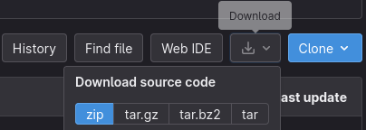

## Installation

[//]: # (TODO: this will be renamed as `Using unofficial modules` and it will be a section in the new modules page; also probably much simpler)

Modules are automatically installed on [Worker](worker.md)'s start-up, you just need to download and **move them to the [Worker's app directory](worker.md#cryton_worker_app_directory)**.

!!! warning ""

    The system requirements for each module have to be **installed manually** as specified in each module's README [here](#availablemodules).

    However, if you're using [Worker's Kali image](worker.md#with-docker) the requirements are already satisfied for the official modules.  
    If the Worker is deployed on a fully-fledged Kali OS, the need to install the system requirements **SHOULD** be also gone. Neither the less, you should check if they're satisfied.

### With git
!!! danger "Requirements"

    - [Git](https://git-scm.com/){target="_blank"}

Clone the repository and checkout the correct version:
```shell
git clone https://gitlab.ics.muni.cz/cryton/cryton-modules.git
cd cryton-modules
git checkout {{{ git_release }}}
```

Make sure the Worker's app directory exists and copy the modules into it:
```shell
mkdir -p ~/.local/cryton-worker/
cp -r modules ~/.local/cryton-worker/
```

### Manually
Go to the [repository](https://gitlab.ics.muni.cz/cryton/cryton-modules/-/tree/{{{ git_release }}}){target="_blank"} and download it:



Finally, extract the `modules` directory from the archive to Worker's app directory (`~/.local/cryton-worker/`).

## Usage
Modules are primarily targeted for use with [Cryton Worker](worker.md).  
Once the Worker receives an execution request, it imports a module, runs it with the supplied arguments, and saves its output.

Even though the modules are Python scripts and can be installed and executed manually, some of them use the Worker's 
[prebuilt functionality](../development/modules.md#prebuilt-functionality), which means you have to run them 
in the same virtual environment as Cryton Worker.

## Available modules
A curated list of modules can be found [here](../modules.md).
