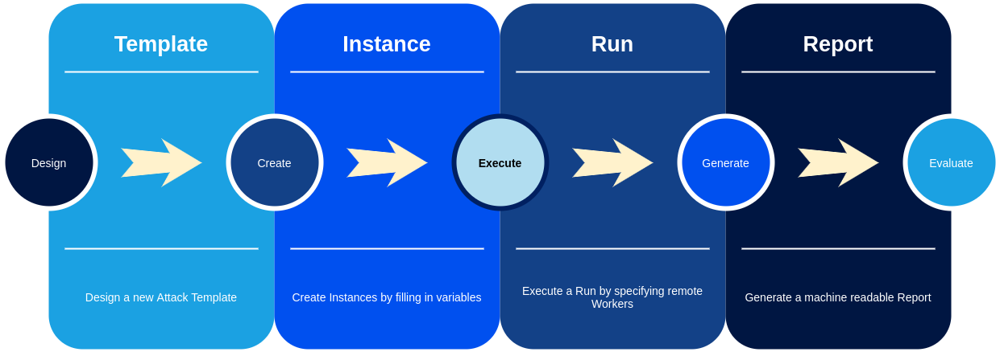
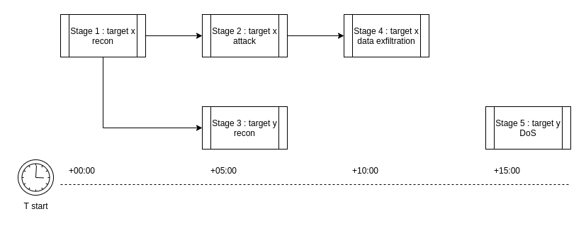

# Creating a scenario

!!! tip "Use JSON schema for real-time template validation!"

    Import the JSON schema located on this address `https://gitlab.ics.muni.cz/cryton/cryton/-/raw/{{{ git_release }}}/cryton.schema.json` to your favourite editor.
    
    * [PyCharm guide](https://www.jetbrains.com/help/pycharm/json.html#ws_json_schema_add_custom)
    * [VS code guide](https://code.visualstudio.com/docs/languages/json#_mapping-in-the-user-settings)

## What is a scenario

??? note "TLDR"

    An attack scenario (also called **[plan](plan.md)**), is divided into different **[stages](stage.md)**. 

    Every stage has its trigger (run at a specific time), as this is often required by an exercise. 

    And finally, each stage consists of attack **[steps](step.md)**, which are organized in a non-binary tree.

Let's start with the description of the attack scenario. Scenario and plan can be used interchangeably - [plan](plan.md) is just 
the name of the element in the formal description of the attack scenario.

An attack scenario is a sequence of steps with some common objective. This objective may be data ex-filtration, access to 
target systems, denial of service, or any other harmful action. For some exercises, every attack should be 
divisible into different [stages](stage.md). Imagine you have to attack infrastructure with multiple machines - each machine can 
be a separate stage. Or you want to attack according to some kill-chain, e.g. the first stage would be scanning of the 
infrastructure, the second is brute force attack on credentials to found systems, etc.

The last and most important element of the plan description is the [step](step.md). This is the execution of an attack script or tool 
against the target. A step can be running a Metasploit exploit, or running a Nmap scan. Steps are dependent on each other, 
and so they create an execution tree, where each of them has set the list of successors based on some condition. The 
condition may be a success or a string value returned by its predecessor.

The lifecycle of the attack scenario in the Cryton context can be seen in the following picture:


## What is a plan template
The first step in designing a plan is creating its template. A template is basically a plan object written in YAML - a description of the actions required to run during attack execution.


The template itself is not a fully described attack scenario. The structure of the attack (execution tree) is correct, but there are still unfilled places (e.g. IP addresses of targets or other [inventory variables](#inventory-files)). This way a template can be designed before knowing these details and used in multiple different environments.

An abstract plan can look like this:
```yaml
Stage 1
  Step 1
  Step 2
Stage 2
  Step 3
```

## What is a plan instance
While Template contains unfilled variables (therefore the name "template"), Plan instance fills these things in by combining the template with an **[inventory file](#inventory-files)**. This file contains all information that needs to be filled in the template. After instantiation, everything is ready to create a **Run**.

!!! warning

    After creating the Plan instance only the [Execution variables](step.md#execution-variables) can be left unfilled and must be explicitly defined as a string.

## Inventory files
When you create a template, you don't always have all the information you need for directly executing it. Or you simply want to make it reusable for other people in their environment. To provide variability in templates we support **inventory files**. These inventory files can be used to provide variable values to templates using **Jinja** language.

A valid Plan file is written in YAML format with variables in the Jinja format, which have to be replaced during the instantiation process.

Inventory file example:
```yaml
names:
  alpha: 127.0.0.1
```

Template example:
```yaml
target: {{ names.alpha }}
```
