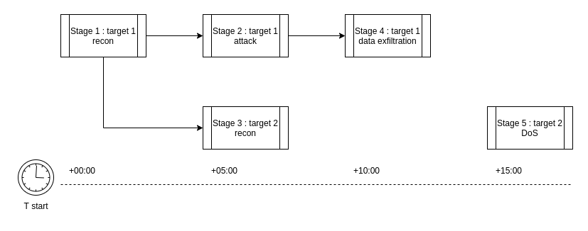

Plan is the basic unit of an attack scenario. It holds settings, basic information about the scenario, and its [stages](stage.md).



Example of defining a plan using YAML:
```yaml
name: my-plan
metadata:
  description: This is an example description
settings:
  separator: |
dynamic: false
stages: {}

```

To better understand what each argument means and defines, here is a short description:

- **name** - Sets the name of the plan.
- **metadata** - An undefined dictionary containing metadata. The `description` parameter is just an example, you can define your own.
- **settings** - Settings used for the entire plan. See the [settings](#settings) section for more details.
- **dynamic** - Whether the plan will be static or the user can temper with it afterward. More information can be found [here](../execution-phase/dynamic-execution.md).
- **stages** - [stages](stage.md) to be executed during the plan's execution.

## Settings

### Separator
If you don't want to use `.` as a separator in [output sharing](step.md#output-sharing), you can use the `separator` parameter.

Example of defining a custom separator:
```yaml
name: my-plan
settings:
  separator: "|"
states: {}

```
