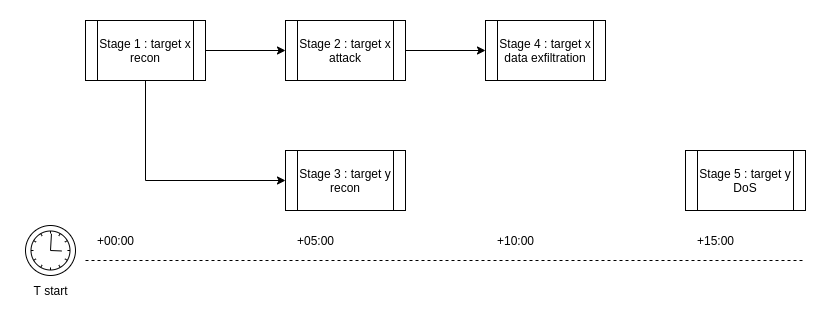

## What is the attack scenario
Let's start with the description of the attack scenario. Scenario and Plan can be used interchangeably - [Plan](plan.md) is just 
the name of the element in the formal description of the attack scenario.

An attack scenario is a sequence of steps with some common objective. This objective may be data ex-filtration, access to 
target systems, denial of service, or any other harmful action. For some exercises, every attack should be 
divisible into different [stages](stage.md). Imagine you have to attack infrastructure with multiple machines - each machine can 
be a separate stage. Or you want to attack according to some kill-chain, e.g. the first stage would be scanning of the 
infrastructure, the second is brute force attack on credentials to found systems, etc.

The last and most important element of the Plan description is the [step](step.md). This is the execution of an attack script or tool 
against the target. A step can be running a Metasploit exploit, or running a Nmap scan. Steps are dependent on each other, 
and so they create an execution tree, where each of them has set the list of successors based on some condition. The 
condition may be a success or a string value returned by its predecessor.

Putting this all together you get the whole attack scenario (called **[Plan](plan.md)**), which is divided into different stages 
(called **[Stage](stage.md)**). Every stage is set to run at a specific time, as this is often required by the exercise. And finally, each 
stage consists of attack steps (called **[Step](step.md)**), which are organized in a non-binary tree described above.

## What is the plan template
The first step in designing a Plan (attack scenario) is creating a plan template. A template is basically a Plan object written in YAML.



The template itself is not a fully described attack scenario. The structure of the Attack (execution tree) is correct, 
but there are still unfilled places (e.g. IP addresses of targets or other [inventory variables](plan-instance.md#inventory-files)). 
This way a template can be designed before knowing these details and used in multiple different environments.

An abstract Plan can look like this:
```yaml
Plan
  Stage 1
    Step 1
    Step 2
  Stage 2
    Step 3
```
