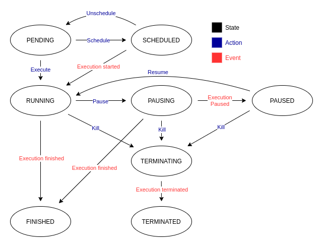
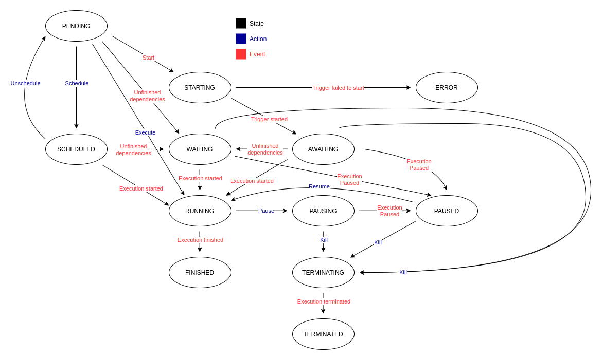
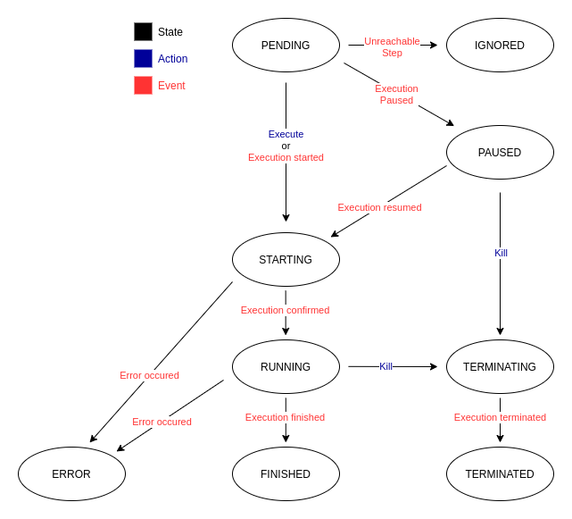

There are special kinds of objects called *Executions* for every unit in the attack scenario:

* **Plan execution**
* **Stage execution**
* **Step execution**

These are not objects that need to be created by you - instead, they are created when their respective unit is executed. 
This way the history and results of each execution can be stored.

Every Execution object stores a start and finish time, so it is easy to count the running times of each unit. With Steps 
the Execution is also a place where the output and results from attack modules are stored.

## Plan execution
For every execution of the Plan (on a given Worker) a new Plan execution is created.

The importance of this object is in keeping the history of executions of a given run. This object also connects all 
other sub-executions (Stage and Step) with the Run.

### Parameters
The following table contains a list of output parameters.

| Name                | Description                              | Type     | Example                     |
|---------------------|------------------------------------------|----------|-----------------------------|
| state               | Current state of the execution.          | string   | PENDING                     |
| start_time          | When the execution started.              | datetime | 2022-07-21T20:37:28.343619Z |
| pause_time          | Time of the last pause.                  | datetime | 2022-07-21T20:37:28.343619Z |
| finish_time         | When the execution finished.             | datetime | 2022-07-21T20:37:28.343619Z |
| schedule_time       | When is the execution supposed to start. | datetime | 2022-07-21T20:37:28.343619Z |
| aps_job_id          | ID of the job in scheduler.              | string   | abcd-1d2c-abcd-1d2c         |
| run                 | Run of which it is a part of.            | int      | 1                           |
| worker              | Which Worker is used for the execution.  | int      | 1                           |
| evidence_directory  | In what directory is the evidence saved. | string   | /path/to/evidence/directory |

### States
Here is a map of allowed states, transitions, and their description.

**PENDING** - Every execution starts its lifecycle in this state - it is inactive.

**SCHEDULED** - Execution with this state will be started at the defined time.

**RUNNING** - Execution is in progress and its sub-executions are being executed.

**PAUSING** - If the user decides to pause the execution, it will change its state to *PAUSING* and wait until the conditions are met.

**PAUSED** - Once all the sub-executions are paused or in a final state, the execution is marked as *PAUSED*.

**TERMINATING** - If the user decides to kill the execution, it will change its state to *TERMINATING* and wait until the conditions are met.

**TERMINATED** - Once all the sub-executions are stopped, the execution is marked as *TERMINATED*.

**FINISHED** - In this state the execution, and its sub-executions have reached final states.

## Stage execution
Stage execution contains execution data for its Stage counterpart.

### Parameters
The following table contains a list of output parameters.

| Name           | Description                              | Type     | Example                     |
|----------------|------------------------------------------|----------|-----------------------------|
| state          | Current state of the execution.          | string   | PENDING                     |
| start_time     | When the execution started.              | datetime | 2022-07-21T20:37:28.343619Z |
| pause_time     | Time of the last pause.                  | datetime | 2022-07-21T20:37:28.343619Z |
| finish_time    | When the execution finished.             | datetime | 2022-07-21T20:37:28.343619Z |
| schedule_time  | When is the execution supposed to start. | datetime | 2022-07-21T20:37:28.343619Z |
| aps_job_id     | ID of the job in scheduler.              | string   | abcd-1d2c-abcd-1d2c         |
| trigger_id     | ID of the trigger on Worker.             | string   | abcd-1d2c-abcd-1d2c         |
| plan_execution | Plan execution of which it is a part of. | int      | 1                           |

### States
Here is a map of allowed states, transitions, and their description.

**PENDING** - Every execution starts its lifecycle in this state - it is inactive.

**SCHEDULED** - Execution with this state will be started at the defined time.

**STARTING** - Action that requires Worker confirmation is occurring - starting listener.

**ERROR** - An error occurred during execution start up - unable to start listener.

**WAITING** - Execution in this state is waiting for its dependencies (other executions) to finish.

**AWAITING** - Execution is awaiting a trigger activation.

**RUNNING** - Execution is in progress and its sub-executions are being executed.

**PAUSING** - If the user decides to pause the execution, it will change its state to *PAUSING* and wait until the conditions are met.

**PAUSED** - Once all the sub-executions are paused or in a final state, the execution is marked as *PAUSED*.

**TERMINATING** - If the user decides to kill the execution, it will change its state to *TERMINATING* and wait until the conditions are met.

**TERMINATED** - Once all the sub-executions are stopped, the execution is marked as *TERMINATED*.

**FINISHED** - In this state the execution, and its sub-executions have reached final states.

## Step execution
Step execution contains execution data for its Step counterpart.

### Parameters
The following table contains a list of output parameters.

| Name              | Description                                                   | Type       | Example                     |
|-------------------|---------------------------------------------------------------|------------|-----------------------------|
| state             | Current state of the execution.                               | string     | PENDING                     |
| start_time        | When the execution started.                                   | datetime   | 2022-07-21T20:37:28.343619Z |
| pause_time        | Time of the last pause.                                       | datetime   | 2022-07-21T20:37:28.343619Z |
| finish_time       | When the execution finished.                                  | datetime   | 2022-07-21T20:37:28.343619Z |
| result            | Result of the module execution.                               | string     | ok                          |
| output            | Received output from the module execution.                    | string     | created session with id 1.  |
| serialized_output | Serializable output from the module execution.                | dictionary | {"session_id": 1}           |
| valid             | Whether the parameters passed to the module are valid or not. | boolean    | true                        |
| stage_execution   | Stage execution of which it is a part of.                     | int        | 1                           |

### States
Here is a map of allowed states, transitions, and their description.

**PENDING** - Every execution starts its lifecycle in this state - it is inactive.

**STARTING** - Action that requires Worker confirmation is occurring - starting the execution.

**RUNNING** - Module execution is in progress.

**PAUSED** - Execution is marked as *PAUSED* if its Stage execution is pausing and only if its about to be executed next.

**TERMINATING** - If the user decides to kill the execution, it will change its state to *TERMINATING* and wait until the conditions are met.

**TERMINATED** - Once the module execution is stopped, the execution is marked as *TERMINATED*.

**FINISHED** - In this state the execution has successfully *FINISHED*.

**ERROR** - An unexpected error occurred during the execution.

**IGNORED** - The conditions to start the execution weren't met.
