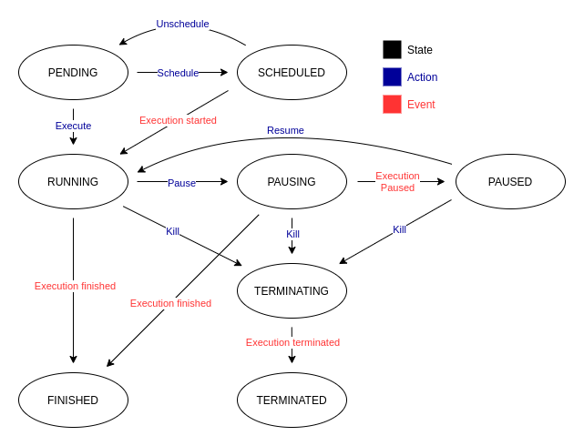

When you finally have a Plan instance stored in the database, you can create a new Run.  
For every Worker, a new Plan execution is created. The reason behind this is a storage of execution history. This way it is possible 
to compare results and use of different [variables](../design-phase/step.md#execution-variables) for each execution.

## Actions
To give you the ability to control your attack plan, here is a list of the supported actions.

### Create
Before we do anything, we have to create the Run instance. It is made of Plan instance and a list of Workers.

??? example

    ```shell
    cryton-cli runs create <plan-id> <worker-id> <worker-id> ...
    ```

### Execute
The basic action you can do is **Execute** the Run. This will start it instantly. What does that mean?

* Delta and DateTime triggered Stages are scheduled
* HTTP/MSF triggers are started on Workers
* Run state is set to RUNNING

??? example

    ```shell
    cryton-cli runs execute <run-id>
    ```

    More information can be found [here](../interfaces/cli.md#runs).

### Schedule, Reschedule, Unschedule
Schedule action does just that - it **schedules** an *Execute* action at a given time. If you want to change the time 
of your execution, you can still **reschedule** it or simply **unschedule** it and leave it in a pending state.

??? example

    ```shell
    cryton-cli runs schedule <run-id> <date> <time>
    ```

    More information can be found [here](../interfaces/cli.md#runs).

### Pause, resume
Anytime during Run execution, you can **pause** it. To continue the Run, simply issue the **resume** command. 

??? example

    ```shell
    cryton-cli runs pause <run-id>
    ```

    More information can be found [here](../interfaces/cli.md#runs).

### Stop
Forcefully stop run and its sub-executions.

??? example

    ```shell
    cryton-cli runs stop <run-id>
    ```

    More information can be found [here](../interfaces/cli.md#runs).

### Validate modules
Check if all the modules used in the Run are present on desired Workers and if their arguments set in the Plan are correct.

??? example

    ```shell
    cryton-cli runs validate-modules <run-id>
    ```

    More information can be found [here](../interfaces/cli.md#runs).

## Parameters
The following table contains a list of output parameters.

| Name          | Description                              | Type     | Example                     |
|---------------|------------------------------------------|----------|-----------------------------|
| state         | Current state of the execution.          | string   | PENDING                     |
| start_time    | When the execution started.              | datetime | 2022-07-21T20:37:28.343619Z |
| pause_time    | Time of the last pause.                  | datetime | 2022-07-21T20:37:28.343619Z |
| finish_time   | When the execution finished.             | datetime | 2022-07-21T20:37:28.343619Z |
| schedule_time | When is the execution supposed to start. | datetime | 2022-07-21T20:37:28.343619Z |
| aps_job_id    | ID of the job in scheduler.              | string   | abcd-1d2c-abcd-1d2c         |
| plan          | Which Plan is used for the execution.    | int      | 1                           |

## States
Here is a map of allowed states, transitions, and their description.



**PENDING** - Every execution starts its lifecycle in this state - it is inactive.

**SCHEDULED** - Execution with this state will be started at the defined time.

**RUNNING** - Execution is in progress and its sub-executions are being executed.

**PAUSING** - If the user decides to pause the execution, it will change its state to *PAUSING* and wait until the conditions are met.

**PAUSED** - Once all the sub-executions are paused or in a final state, the execution is marked as *PAUSED*.

**STOPPING** - If the user decides to stop the execution, it will change its state to *STOPPING* and wait until the conditions are met.

**STOPPED** - Once all the sub-executions are stopped, the execution is marked as *STOPPED*.

**FINISHED** - In this state the execution, and its sub-executions have reached final states.