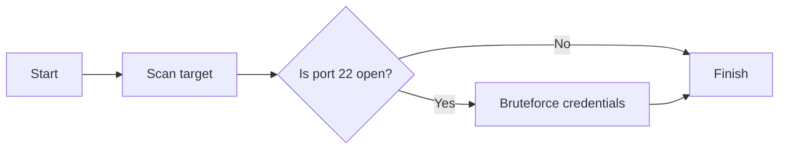

Now, we will walk through an example execution. We will follow the workflow specified in the [previous guide](workflow.md).

!!! warning "Prerequisites"

    It is assumed that you've followed the [quick-start](quick-start.md) guide. If that's not the case, make sure the following requirements are met:

    - [Core](../components/core.md) is up and running
    - Core's [prerequisites](../components/core.md#prerequisites) are up and running
    - [CLI](../components/cli.md) is installed
    - [Worker](../components/worker.md) is installed, running, and correctly set up to use the [modules](../components/modules.md)
    - Worker's [prerequisites](../components/worker.md#prerequisites) are up and running
    - [Modules](../components/modules.md#installation)' system requirements are satisfied
    - If CLI and Core are not on the same machine, make sure to update [CLI's settings](../components/cli.md#crytoncliapihost)

## Create a plan template
To execute our attack plan, we must create its [template](../design-phase/template.md) first – a description 
of the actions required to run during attack execution based on tools used during the attack.

We will be using a basic example, which can be found 
[here](https://gitlab.ics.muni.cz/cryton/cryton-core/-/tree/{{{ git_release }}}/examples){target="_blank"} as well as other examples.

Download it [manually](https://gitlab.ics.muni.cz/cryton/cryton-core/-/blob/{{{ git_release }}}/examples/basic-example/template.yml){target="_blank"} or using:

=== "curl"

    ```shell
    curl -O https://gitlab.ics.muni.cz/cryton/cryton-core/-/raw/{{{ git_release }}}/examples/basic-example/template.yml
    ```

=== "wget"

    ```shell
    wget https://gitlab.ics.muni.cz/cryton/cryton-core/-/raw/{{{ git_release }}}/examples/basic-example/template.yml
    ```

It describes a 2 step attack plan. First, it scans the target and checks if port 22 is open. If the port is open, it tries to brute force the credentials.



---

If we are satisfied with our template, we can upload it using CLI:
```shell
cryton-cli plan-templates create path/to/template.yml
```

??? example "Example"

    ```shell
    cryton-cli plan-templates create template.yml
    ```

    Expected output:
    ```
    Template successfully created! ({'id': 1})
    ```

??? tip "Validate the template first"

    Before we upload the template, we should validate it. However, for our template to be validated correctly, 
    we have to provide an inventory file, which is described [here](#create-a-plan-instance). Once we have it, we can simply run:
    ```shell
    cryton-cli plans validate template.yml -i inventory.yml
    ```
    
    ??? example "Example"
        
        ```shell
        cryton-cli plans validate template.yml -i inventory.yml
        ```
    
        Expected output:
        ```
        Plan successfully validated! (<response>)
        ```

    Don't forget to upload the template afterward.

## Register the Worker
To be able to use our Worker, we have to register it. Keep in mind that **WORKER_NAME** must match the Worker’s `CRYTON_WORKER_NAME` setting:
```shell
cryton-cli workers create <WORKER_NAME> -d <WORKER_DESCRIPTION>
```

??? example "Example"

    ```shell
    cryton-cli workers create local_worker -d "my worker on localhost"
    ```

    Expected output:
    ```
    Worker successfully created! ({'id': 1})
    ```

To check if the Worker is running, use the health check:
```shell
cryton-cli workers health-check <WORKER_ID>
```

??? example "Example"
    
    ```shell
    cryton-cli workers health-check 1
    ```

    Expected output:
    ```
    The Worker successfully checked! (<response>)
    ```

## Create a Plan instance
Now we need to create a Plan instance we will use for the execution. Create it using a combination of 
the previously uploaded template and an [inventory file](../design-phase/plan-instance.md#inventory-files).

Download the inventory file [manually](https://gitlab.ics.muni.cz/cryton/cryton-core/-/blob/{{{ git_release }}}/examples/basic-example/inventory.yml){target="_blank"} or using:

=== "curl"

    ```shell
    curl -O https://gitlab.ics.muni.cz/cryton/cryton-core/-/raw/{{{ git_release }}}/examples/basic-example/inventory.yml
    ```

=== "wget"

    ```shell
    wget https://gitlab.ics.muni.cz/cryton/cryton-core/-/raw/{{{ git_release }}}/examples/basic-example/inventory.yml
    ```

It determines the missing variables in the template. More precisely, it states the target and the credentials used for the brute force attack.

To create a new Plan instance use:
```shell
cryton-cli plans create <TEMPLATE_ID> -i path/to/my/inventory.yml
```

??? example "Example"
    
    ```shell
    cryton-cli plans create 1 -i inventory.yml
    ```

    Expected output:
    ```
    Plan Instance successfully created! ({'id': 1})
    ```

## Create a Run
The last step we have to make is to create a new [Run](../execution-phase/run.md) from the previously created Plan instance 
and Worker(s). To do so, use:
```shell
cryton-cli runs create <PLAN_INSTANCE_ID> <WORKER_ID1> <WORKER_ID2> <WORKER_ID3> ...
```

??? example "Example"

    ```shell
    cryton-cli runs create 1 1 2 3
    ```

    Expected output:
    ```
    Run successfully created! ({'id': 1})
    ```

## Execute the Run

!!! warning "It works.. but at what cost?"

    Please, make sure that you are allowed to run the scan and brute force (there **shouldn't** be any problems doing so on **localhost**). 
    Otherwise, there may be consequences.

Now that everything is prepared, we can execute our Run immediately or schedule it for later.

=== "immediately"

    To execute the Run immediately use:

    ```shell
    cryton-cli runs execute <RUN_ID>
    ```

    ??? example "Example"
    
        ```shell
        cryton-cli runs execute 1
        ```

        Expected output:
        ```
        Run successfully executed! (Run 1 was executed.)
        ```

=== "schedule it for later"

    Run executions can be scheduled to a specific date and time. By default, the system timezone will be used. To use the UTC timezone, use the `--utc-timezone` flag.
    ```shell
    cryton-cli runs schedule <RUN_ID> <DATE> <TIME>
    ```
    
    ??? example "Example"
    
        ```shell
        cryton-cli runs schedule 1 2020-06-08 10:00:00
        ```

        Expected output:
        ```
        Run successfully scheduled! (Run 1 is scheduled for 2020-06-08 10:00:00.)
        ```

## Show Run information
To see if the executed Run has finished, you can check its state (and other useful information):
```shell
cryton-cli runs show <RUN_ID>
```

??? example "Example"
    
    ```shell
    cryton-cli runs show 1
    ```

    Expected output:
    ```
    id: 1, schedule_time: None, start_time: 2021-05-24T00:08:45.200025, pause_time: None, finish_time: 2021-05-24T00:09:18.397199, state: RUNNING
    ```

## Get a report
It is crucial to know the current state of your Run and its results. That is why a report can be generated anytime during the execution:
```shell
cryton-cli runs report <RUN_ID>
```

??? example "Example"
    
    ```shell
    cryton-cli runs report 1
    ```

    Expected output:
    ```
    Successfully created Run's report! (file saved at: /tmp/report_run_1_2020-06-08-10-15-00-257994_xdQeV)
    ```

??? tip "Read the report directly"

    Reports can be viewed directly in cryton-cli (**to quit, press Q**):
    ```shell
    cryton-cli runs report <RUN_ID> --less
    ```
    
    ??? example "Example"
        
        ```shell
        cryton-cli runs report 1 --less
        ```
