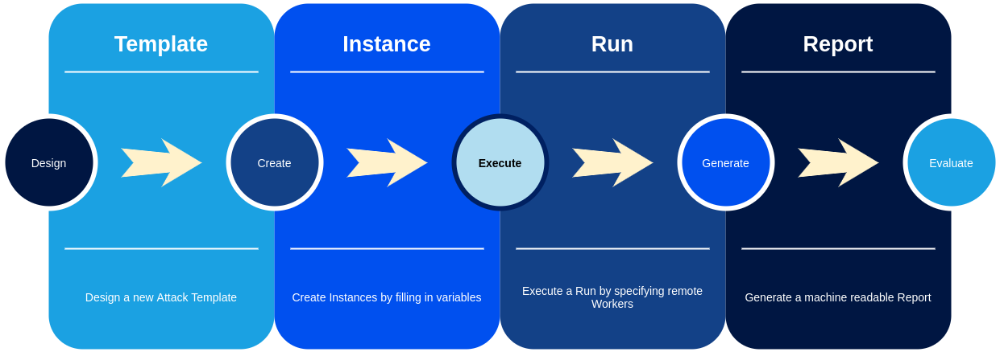

Cryton toolset is a Cron-like red team framework for complex attack scenarios automation and scheduling. Through the usage of Core, 
Worker, and attack modules it provides ways to plan, execute and evaluate multistep attacks.

???+ question "Are there any other usages?"

    - Breach & attack emulation
    - Automation of penetration testing and infrastructure scanning
    - Scheduler or executor across multiple environments

!!! tip "No time to read?"

    Check out the [quick-start](getting-started/quick-start.md) guide.

The lifecycle of the attack scenario in the Cryton context can be seen in the following picture:

All of its open-source components [can be found here](https://gitlab.ics.muni.cz/cryton){target="_blank"}.

## Purpose
The main purpose of the Cryton is **to execute complex attack scenarios, in which the system under test is known in advance**. 
It was designed as such to assist red teams in cybersecurity exercises in means of repeatability of certain attack scenarios. 
These scenarios are often prepared in advance and reflect vulnerabilities hidden in the blue team's infrastructure.

Imagine you are taking part in a cyber defense exercise as a tutor. The task for your trainees is to defend a system or a 
whole infrastructure (which you prepared) against an attacker. This system is full of vulnerabilities and misconfigurations 
(which you prepared as well). Your trainees have e.g. one hour to fix as many of these issues as they can find. Imagine then 
that you have to check each system for all the fixes to see how your trainees managed to succeed. How would you 
do that effectively?

This is where Cryton comes to play. If you know all the vulnerabilities in the trainees' system - and you do - you can prepare 
an attack scenario to check if they are still available and working after the fix. Cryton will execute the plan against 
all targets you tell it to and then generate reports (human and machine-readable). You can then not only see, which 
attack steps did succeed on which system, but also score your trainees based on these results.

With this in mind, you should not expect Cryton to be some kind of evil artificial intelligence capable of taking over the 
world. It is simply a scheduler for python modules. The scheduler executes these modules according to some execution 
tree with conditions based on each step of the scenario. Each module is a script orchestrating some well-known 
attack tools, but that is it.

## Support
Cryton toolset is tested and targeted primarily on **Debian** and **Kali Linux**. However, it **should** be possible to 
use it everywhere if the requirements are met. Please keep in mind that **only the latest version is supported** and 
issues regarding different OS or distributions may **not** be resolved.

!!! note ""

    The Docker images should render the support limitations irrelevant.

!!! warning "Make sure the versions are compatible"

    The first number of the version must match. Otherwise, the components may not be able to work together.
    For example, if you want to install version `1.0.0` (major.minor.patch), all Cryton tools must start with `1` 
    (in other words, the **major versions must match**).

    ---

    In order to mitigate some issues with maintaining multiple tools, minor versions indicate new, backward incompatible functionality.
    However, it doesn't break the compatibility between the components. The only problem is you might not be able to use the new features if all components don't support them.

    In practice, imagine you are running version 1.0.0. A new feature (weekly scheduling) gets added to the *Core*, and the version gets bumped to *1.1.0*.
    Since this feature doesn't involve other components, you don't have to update them.
    
    On the other hand, if we implement a second feature like a new Step type, which gets implemented on *Worker* (version bumped to *1.1.0*) 
    and *Core* (which is now version *1.2.0*), you have to update both to be able to use the new Step type.

[//]: # ([:octicons-tag-24: Core 1.1.0]({{{ releases.core }}}1.1.0){target="_blank"})

## History
The releases and their changes are on the official Gitlab release page, depending on the component:

- [Cryton Core]({{{ releases.core }}})
- [Cryton Worker]({{{ releases.worker }}})
- [Cryton modules]({{{ releases.modules }}})
- [Cryton CLI]({{{ releases.cli }}})
- [Cryton Frontend]({{{ releases.frontend }}})
- [Cryton Playground]({{{ releases.playground }}})
- [Cryton E2E]({{{ releases.e2e }}})
