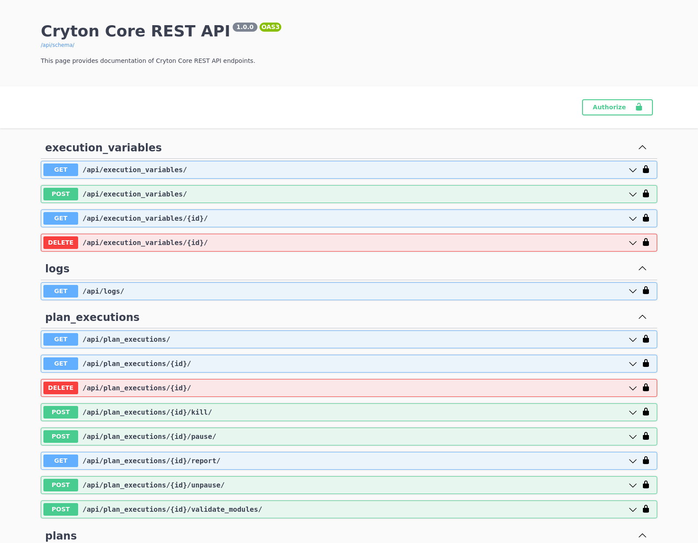
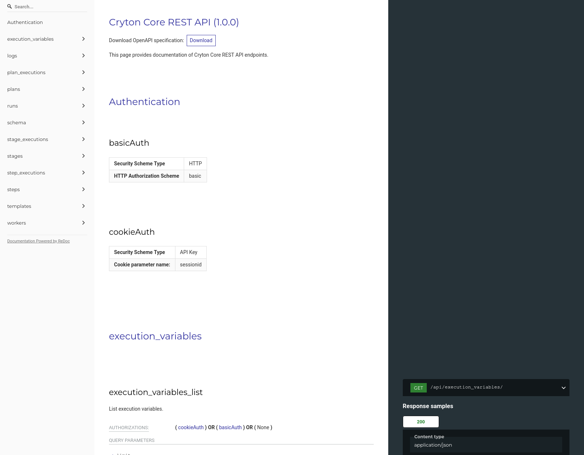

This page provides information about the (self-hosted) interactive documentation of the Cryton REST API endpoints. 
It also provides a list of changes and some important notes.

To access the Swagger or Redoc pages, install and start the Cryton Core application as described [here](../getting-started/quick-start.md) or [here](../components/core.md).

!!! danger "Uploading files"

    Files must be uploaded as **bytes** and encoded using **UTF-8**.

## Swagger interactive documentation
If you are interested in the Swagger interactive documentation, open the Cryton REST API or browse to the `/doc` endpoint.  
For example: [http://127.0.0.1:8000/doc/](http://127.0.0.1:8000/doc/){target="_blank"}.

## Redoc interactive documentation
If you are interested in the Redoc interactive documentation, browse to the `/redoc` endpoint on Cryton REST API.  
For example: [http://127.0.0.1:8000/redoc/](http://127.0.0.1:8000/redoc/){target="_blank"}.

## API changes

!!! info "/api/logs/"

    [:octicons-tag-24: Core 1.1.0]({{{ releases.core }}}1.1.0){target="_blank"}
    
    Added ability to filter the logs using multiple substrings in the following format: `substring1|substring2`.
