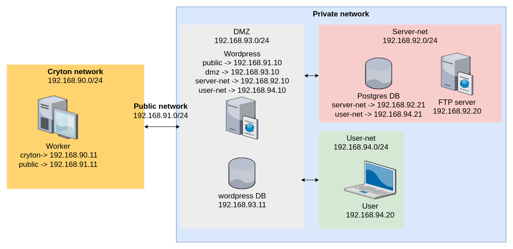
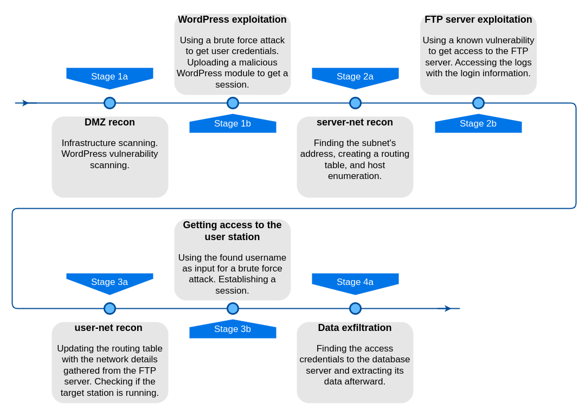

Playground is an isolated Docker environment where you can test Cryton's capabilities.

- With a single command you can build the whole infrastructure
- With a single command you can run a predefined attack plan
- It will run on your machine
- It takes minutes to build and is easy to reset
- It allows you to quickly run [E2E tests](development/index.md#e2e)



??? note "Limitations"

    Docker Compose configuration doesn't allow custom gateways/routers which results in creating overlying networks that simulate separated networks.

## Setup

!!! danger "Requirements"

    - [Git](https://git-scm.com/)
    - [Docker Compose](https://docs.docker.com/compose/install/){target="_blank"}
    - System with **8192 MB of RAM** and **4 CPU cores**

First, we clone the repository and switch into it:
```shell
git clone https://gitlab.ics.muni.cz/cryton/cryton.git
cd cryton
```

Now, we build the infrastructure:
```shell
docker compose -f docker-compose.yml -f docker-compose.playground.yml up -d --build
```

Once we are done, Cryton toolset and vulnerable targets should be up and running.

## Run the prepared scenario
We have prepared an example attack scenario that uses multiple Cryton features ([session management](design-phase/step.md#session-management),
[output sharing](design-phase/step.md#output-sharing), [conditional execution](design-phase/step.md#conditional-execution), ...).



Run the following script in the CLI container to automatically prepare and execute the scenario:
```shell
docker compose exec cryton_cli /opt/resources/run_example_scenario.sh
```

Progress and results can be viewed in the *front-end* at [http://localhost:8080/](http://localhost:8080/).

??? note "Instructions for manually running the scenario"

    Enter the CLI container:
    ```shell
    docker compose exec -it cryton_cli bash
    ```

    Register and check the Worker:
    ```shell
    cryton-cli workers create worker
    cryton-cli workers health-check <worker-id>
    ```
    
    Validate the template:
    ```shell
    cryton-cli plans validate /opt/resources/template.yml -i /opt/resources/inventory.yml
    ```
    
    Upload the template, create a Plan and a Run:
    ```shell
    cryton-cli plan-templates create /opt/resources/template.yml
    cryton-cli plans create <plan-template-id> -i /opt/resources/inventory.yml
    cryton-cli runs create <plan-id> <worker-id>
    ```
    
    Execute the Run:
    ```shell
    cryton-cli runs execute <run-id>
    ```
    
    Check status of the Run:
    ```shell
    cryton-cli runs show <run-id>
    ```
    
    Generate Run report:
    ```shell
    cryton-cli runs report <run-id>
    ```

## Create your own scenario
If you know what you're doing, you can try to come up with your own attack plan.

Feel free to access the Worker container and try to find vulnerabilities and attack vectors that you could utilize in your final scenario. If the provided infrastructure is not ideal for your needs, you can also add more containers.

??? question "How do I access a container?"

    Generally you want to start an interactive session inside the container using:
    ```shell
    docker compose exec -it <container_name> bash
    ```
    
    To access the Worker container use:
    ```shell
    docker compose exec -it cryton_worker bash
    ```

## Troubleshooting

### Unable to build the infrastructure
Make sure the address pools and ports the playground uses are available.

### Services are not running correctly
If you're having problems with the services (they keep restarting for example):

1. Shut down the running infrastructure with no timeout:
    ```shell
    docker compose -f docker-compose.yml -f docker-compose.playground.yml down -t 0
    ```

2. Remove **all** data, volumes, images, and containers:
    ```shell
    docker system prune --volumes --all --force
    docker volumes prune --all
    ```

3. Build the Infrastructure again:
    ```shell
    docker compose -f docker-compose.yml -f docker-compose.playground.yml up -d --build
    ```

[//]: # (TODO: the proxy settings don't work since the domain names are different)
[//]: # (### Proxy settings)

[//]: # (If you're using a proxy, paste the following settings into `~/.docker/config.json` on your host:)

[//]: # (```)

[//]: # ({)

[//]: # ( "proxies":)

[//]: # ( {)

[//]: # (   "default":)

[//]: # (   {)

[//]: # (     "httpProxy": "<proxy-address>",)

[//]: # (     "httpsProxy": "<proxy-address>",)

[//]: # (     "noProxy": "localhost,.cryton")

[//]: # (   })

[//]: # ( })

[//]: # (})

[//]: # (```)
